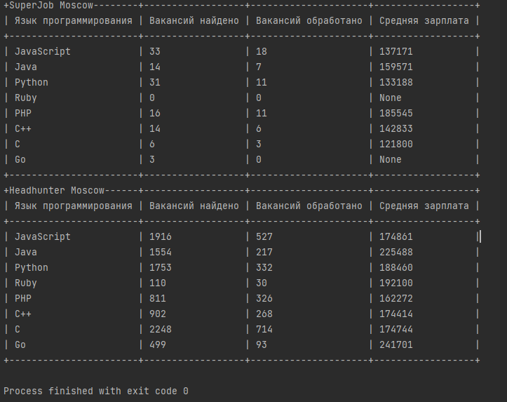

# Сравниваем вакансии программистов
## Описание проекта:
Этот проект разработан для получениия информации по рабочим вакансиям. Вакансии взяты с headhunter и superjob.

## Как установить
Для правильной работы проекта необходим Python3. Его можно установить по этой [ссылке](https://www.python.org/downloads/). Подойдёт версия `3.9.0`.
Для установки зависимости необходимо выполнить команду: 
```python
pip install -r requirements.txt
```

## Переменные окружения 
Переменные окружения — именованные переменные, содержащие текстовую информацию, которую могут использовать запускаемые программы.

Нужно создать файл `.env`, в котором бдут храниться переменные окружения:

Пример заполнения файла `.env`:
```
SUPERJOB_KEY=secret_key
```
secret_key-ключ для superjob, котрый можно получить по [ссылке](https://api.superjob.ru/).

## Запуск проекта
Для работы программы нужно запустить `create_tables.py`.

Пример запуска:
```python
create_tables.py
```
В результате вы получите две разные таблицы с зарплатами, взятыми из вакансий headhunter и superjob.

Пример ввывода:


## Цель проекта

Код написан в образовательных целях на онлайн-курсе для веб-разработчиков [dvmn.org](https://dvmn.org/).
 
